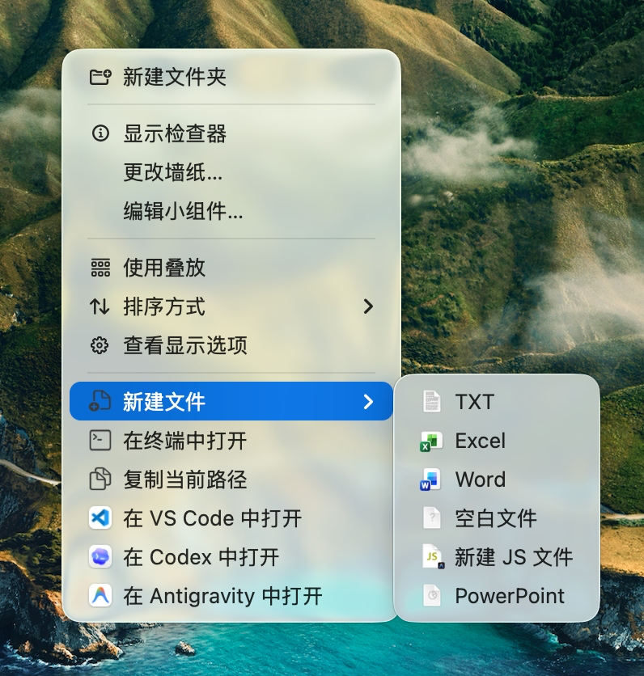
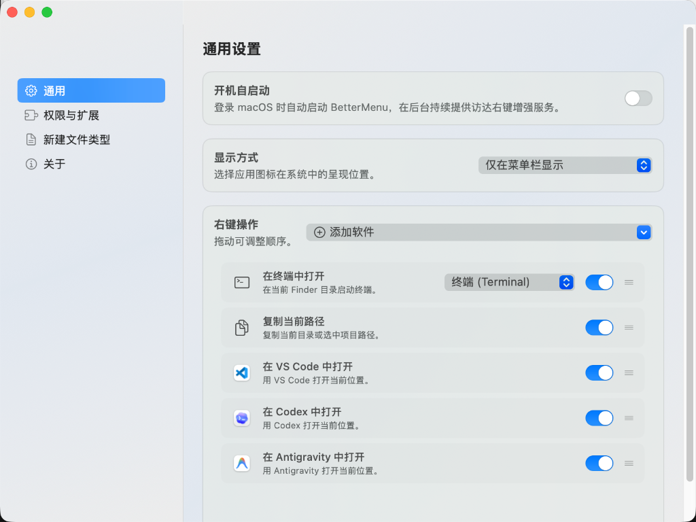
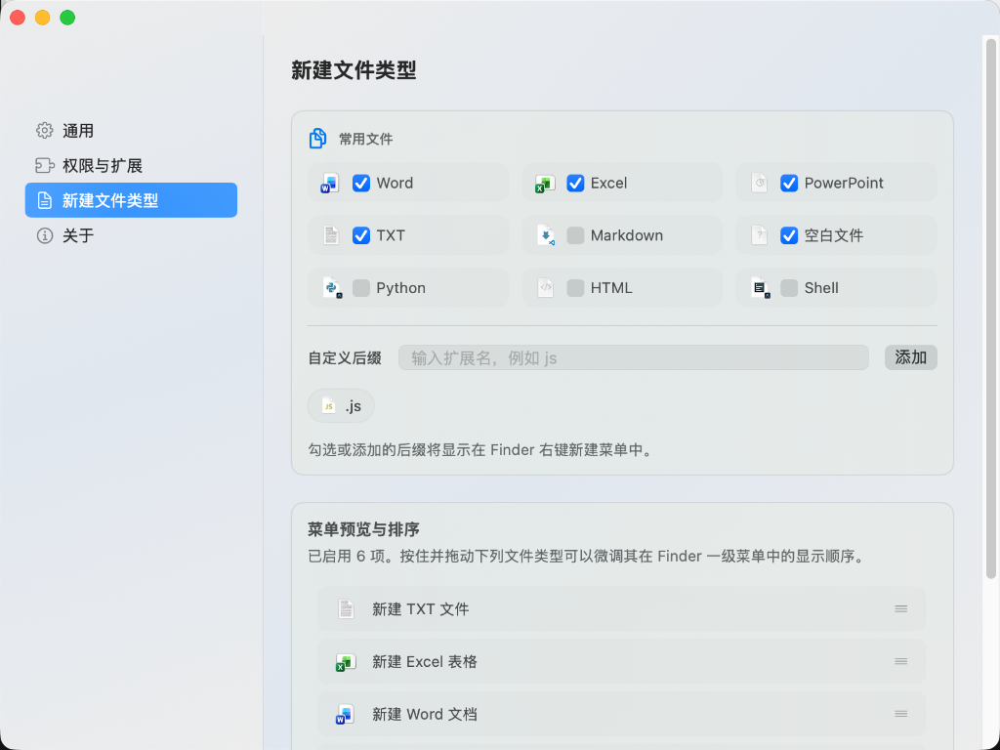
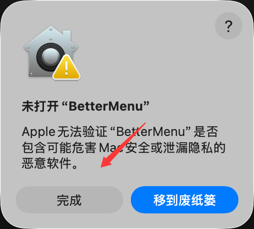
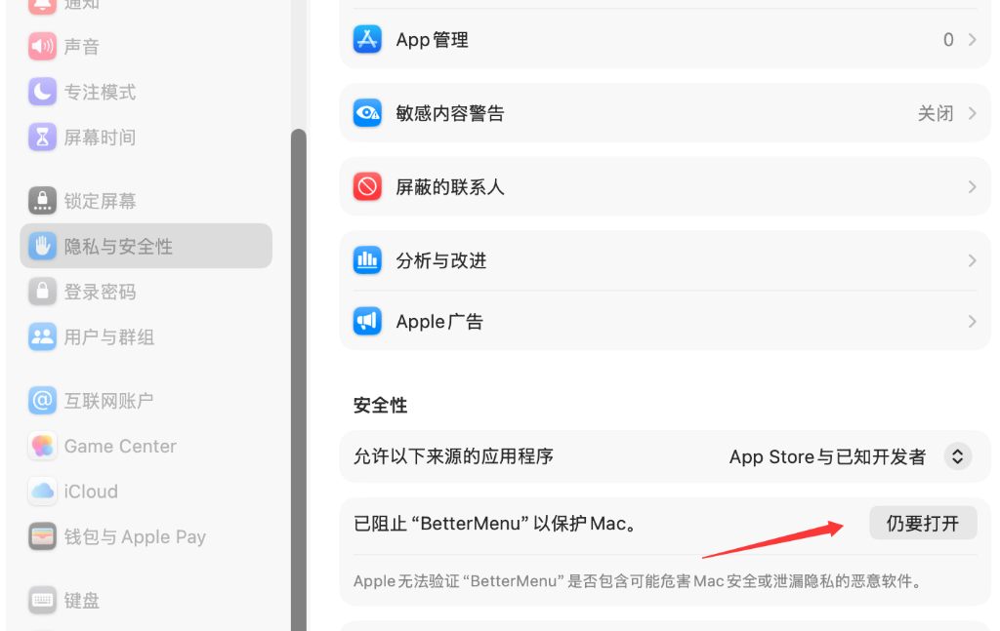
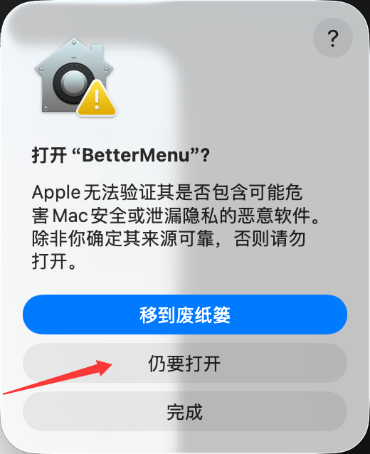

# BetterMenu

<p align="center">
  
  
  
</p>

BetterMenu 是一款功能强大的 macOS 右键菜单增强工具，让 macOS 的右键菜单像 Windows 一样高效好用。

<p align="center">
  
</p>

<p align="center">
  
  
</p>

---

## ✨ 核心功能

- 📂 **快速新建文件**：
  - 支持快捷新建 `txt`、`md`、`docx`、`xlsx`、`pptx`、`json`、`py`、`html`、`sh` 等文件。
  - 支持自定义新建文件的后缀扩展名，灵活扩展。
- 💻 **快速在终端/编辑器中打开**：
  - 支持系统自带终端（Terminal）。
  - 支持主流代码编辑器一键拉起：**VS Code**、**Cursor**、**OpenAI Codex**、**Xcode**、**Sublime Text**、**IntelliJ IDEA**、**WebStorm**、**PyCharm**、**Android Studio**、**CotEditor**。
- 📋 **一键复制路径**：
  - 快速复制当前访达目录或选中文件的绝对路径。
- ⚙️ **SwiftUI 设置面板与状态栏菜单**：
  - 现代化、清爽的设置界面，支持调整右键菜单项的启用状态与排序，即时同步生效。
  - 支持通过系统状态栏菜单快速调起面板、重启 Finder 访达、或退出软件。


---

## 🚀 安装与启用

### 1. 下载应用
您可以前往 [GitHub Releases](https://github.com/zombieht/BetterMenu/releases) 页面下载最新版本的安装包（或直接点击 [最新版本下载](https://github.com/zombieht/BetterMenu/releases/latest)）。

### 2. 解决隔离属性问题

下载安装包后，若遇到“无法打开，因为无法确认开发者身份”或“无法验证”提示，请按以下方式解决：

#### 💡 常规方法（图形界面操作）：

1. 首次打开时，若弹出“未打开 BetterMenu”对话框，点击 **完成** 按钮关闭弹窗：
   <br/><br/><br/>

2. 前往 **系统设置 (System Settings)** -> **隐私与安全性 (Privacy & Security)**，滑动到下方“安全性”一栏，点击 **仍要打开 (Open Anyway)** 按钮：
   <br/><br/><br/>

3. 随后系统会弹出二次确认弹窗，点击 **仍要打开** 即可正常运行软件：
   <br/><br/><br/>

#### 💻 快捷命令（终端操作）：

直接在终端运行以下命令移除隔离属性：

```bash
xattr -cr /Applications/BetterMenu.app
```

### 3. 启用 Finder 扩展（关键步骤）
由于 macOS 的安全策略，您需要手动为本软件授予 Finder 扩展权限，右键菜单方可生效：
1. 打开 **系统设置** (System Settings)。
2. 导航至 **隐私与安全性** (Privacy & Security) -> **扩展** (Extensions) -> **Finder 扩展** (Finder Extensions)。
3. 勾选启用 **BetterMenu**。

---

## 📦 系统要求

- **操作系统**：macOS 15.0 或更高版本
- **开发工具**：Xcode 16.0+
- **Swift 语言模式**：Swift 6.0+

---

## 🛠 本地开发与构建

在本地克隆代码后，可通过项目内提供的脚本进行便捷的构建与管理。

### 本地开发运行
编译、运行主 App 并自动注册 Finder Sync 扩展：
```bash
./script/build_and_run.sh run
```

### 仅构建并注册扩展
如果只需重新注册 Finder Sync 扩展，可执行：
```bash
./script/build_and_run.sh register
```

### Release 打包
生成生产环境发布包（DMG/ZIP）：
```bash
./script/package.sh
```

---

## 📖 开发者架构文档

如果您打算贡献代码或想深入了解 BetterMenu 的内部机制，请参阅：
👉 [BetterMenu 开发与架构指南 (DEVELOPMENT.md)](./DEVELOPMENT.md)

---

## 🤝 鸣谢

本项目在设计与开发过程中借鉴了以下优秀开源项目，在此表示衷心的感谢：

- [QuickDoc](https://github.com/SkyImplied/QuickDoc)：为本项目提供了菜单构建与功能设计上的灵感与借鉴。

## 📄 开源许可证

本项目基于 [MIT License](https://opensource.org/licenses/MIT) 许可协议开源。
